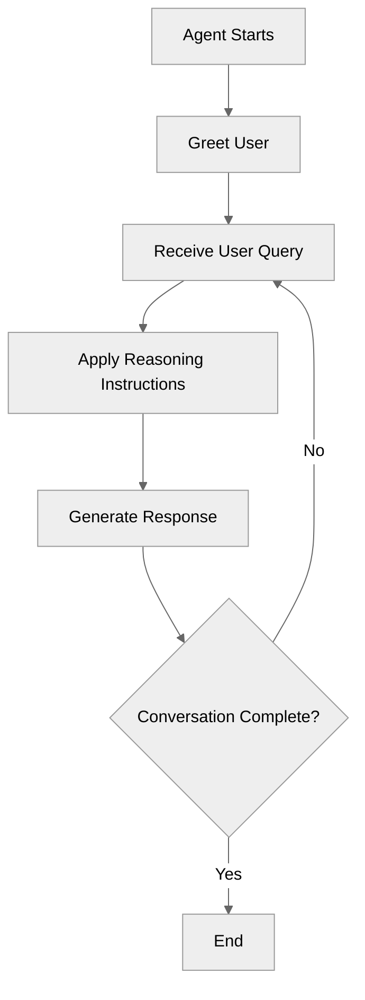
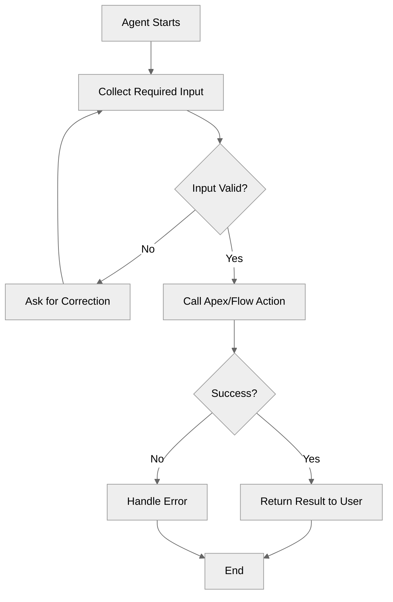
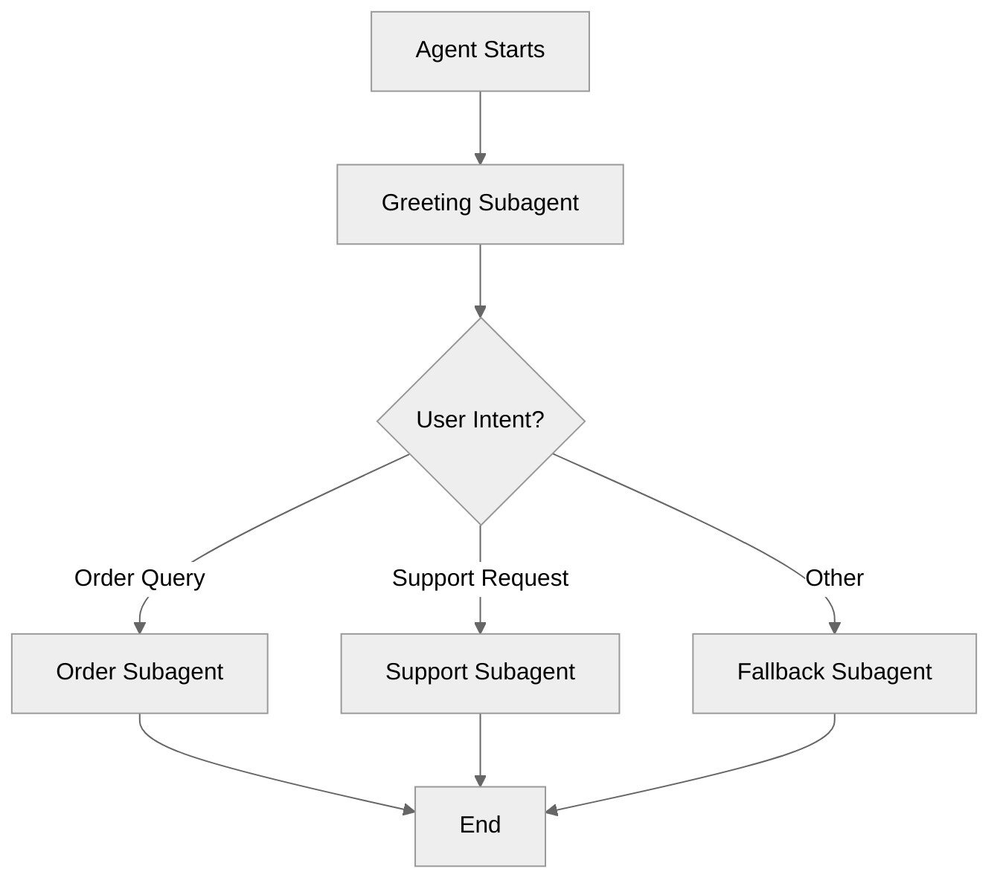

## Task

You are a technical writer and Salesforce Agentforce expert. Generate a complete `README.md` for the **$recipe_name** recipe following the strict structure and formatting rules from `README_STRUCTURE.md` and `MERMAID_DIAGRAMS.md` in the trailheadapps/agent-script-recipes repository.

---

## Discovery (ask if not provided)

Before generating, confirm:
1. **What it demonstrates** — The key feature, pattern, or syntax element this recipe teaches
2. **Agent flow** — The high-level steps/subagents involved (e.g., greet → look up order → respond → end)
3. **Key actions** — What Apex, Flow, or Prompt Template actions the agent calls
4. **Example conversation** — At least one user message and expected agent response
5. **Related recipes** — Any other recipes in the repo this one connects to

---

## Required Sections (in this exact order)

### 1. Title
```markdown
# $recipe_name
```

### 2. Overview
- 2-3 sentences covering:
  - What the recipe demonstrates
  - Why it is useful
  - The specific problem it solves or concept it teaches

### 3. Agent Flow
- Mermaid diagram — **mandatory rules:**
  - Always start with `%%{init: {'theme':'neutral'}}%%`
  - Always use `graph TD` (top-down, never LR/RL/BT)
  - Node IDs: sequential capital letters A, B, C, ...
  - Process steps: `[square brackets]`
  - Decision points: `{curly braces?}` — always end with `?`
  - Branch labels: `|Yes|` / `|No|`, `|Success|` / `|Failure|`, `|Valid|` / `|Invalid|`
  - Max 20-25 nodes — split if needed
  - No custom color styling
  - Multi-line labels: use `<br/>` sparingly

```markdown
## Agent Flow

\```mermaid
%%{init: {'theme':'neutral'}}%%
graph TD
    A[Agent Starts] --> B{...}
    ...
\```
```

### 4. Key Concepts
Bulleted list:
```markdown
## Key Concepts

- **Concept Name**: Brief description of the feature or pattern
- **Another Concept**: ...
```

### 5. How It Works
- Core educational section with H3 subsections
- Explain *why*, not just *what*
- Use `agentscript` code blocks for inline examples
- Connect back to the Key Concepts listed above

```markdown
## How It Works

### Subsection Title

Explanation of why this design choice was made...

\```agentscript
// relevant code block
\```
```

### 6. Key Code Snippets
- Highlight the most important blocks from the `.agent` file
- Each snippet has an H3 title
- Use `agentscript` code blocks
- Make snippets self-contained enough to understand without full context

### 7. Try It Out
- Explain how to interact with the agent
- **Mandatory**: "Example Interaction" subsection with a `text` code block

```markdown
## Try It Out

Start a conversation with the agent and try these prompts:

### Example Interaction

\```text
Agent: Hello! How can I help you today?

User: I need to check my order status.

Agent: Sure! Can you provide your order number?
\```

### Behind the Scenes

Explanation of what the agent is doing during specific turns.
```

### 8. What's Next
```markdown
## What's Next

- **RelatedRecipeName**: Why it's relevant and what it builds on
- **AnotherRecipe**: ...
```

### 9. Testing (optional but recommended)
```markdown
## Testing

- Test case 1: Input → Expected output
- Test case 2: ...
```

### 10. Notes (optional)
```markdown
## Notes

Any caveats, known limitations, or important context.
```

---

## Mermaid Diagram Patterns to Use

### Simple Q&A Agent


### Action-Based Agent


### Multi-Subagent Router


---

## Formatting Rules

- Code blocks: `agentscript` for agent script, `text` for transcripts, `apex` for Apex, `json` for data
- Headings: `#` top level, `##` sections, `###` subsections
- Bold: key terms, variable names, UI elements
- Inline code: file names, specific values, short syntax elements
- Tone: educational, clear, action-oriented — explain *why*, not just *how*

---

## Output

Generate the complete `README.md` content, ready to save. After the README, add a 2-bullet summary of:
- The Mermaid diagram design decisions made
- Any sections left with placeholder content that the user should fill in
